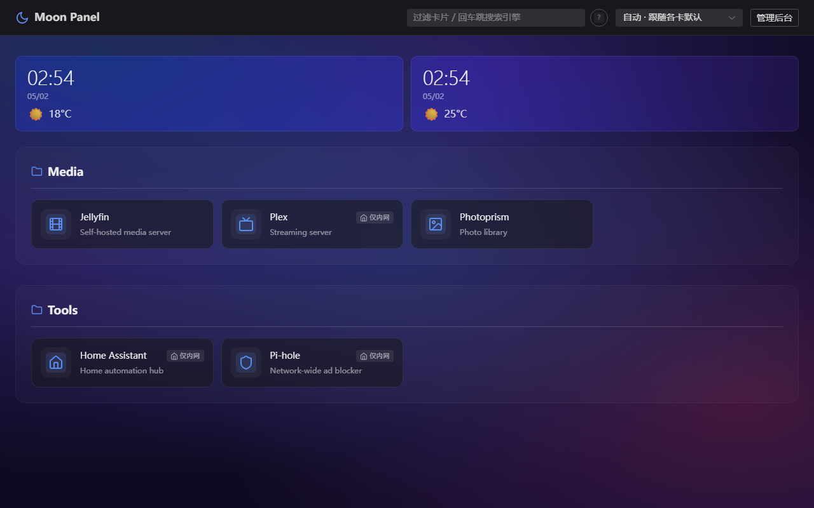
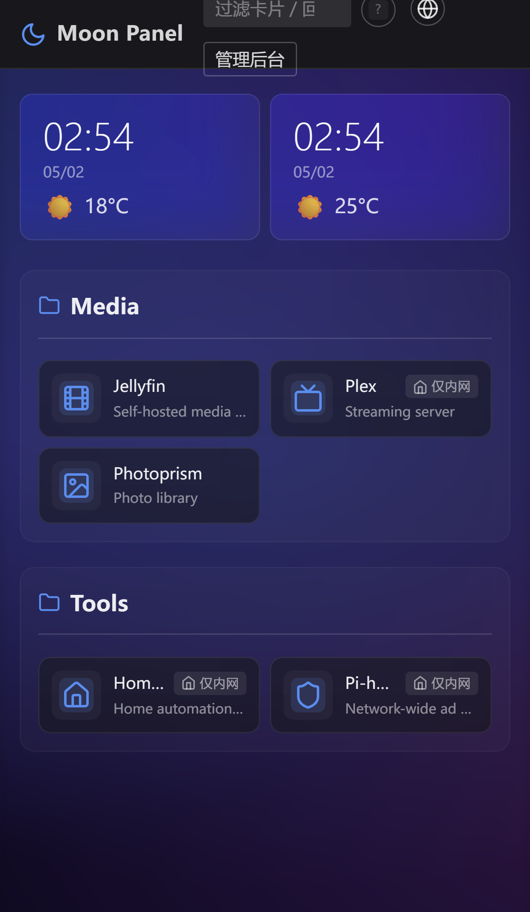
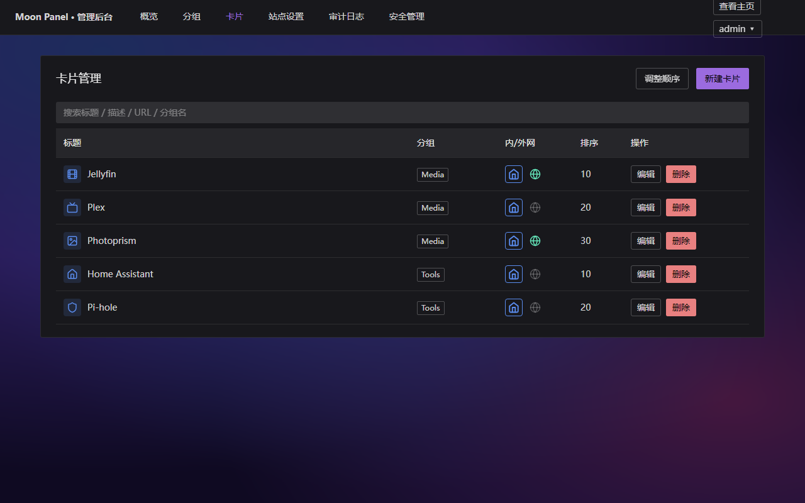
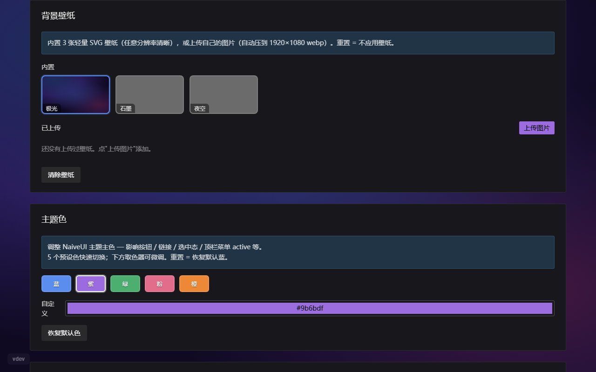

# 🌙 Moon Panel

> 自托管个人导航面板，Sun-Panel 的轻量替代品。

[English](README.md) · [中文版](README.zh-CN.md)

[](https://github.com/bevanho777-max/moon-panel/actions/workflows/ci.yml)
[](LICENSE)
[](https://github.com/bevanho777-max/moon-panel/releases)

Moon Panel 是给家庭实验室和个人服务用的自托管导航首页。单文件 Go 二进制，前端
通过 `go:embed` 内嵌进二进制，纯 Go 实现的 SQLite（无 CGO）。同一份多架构
Docker 镜像在树莓派、群晖 NAS、VPS 上都能跑。

按设计是单用户面板：一个密码，无邮箱、无 SSO、无注册。主页默认公开，仅
`/admin` 需要登录。每张卡片同时携带内网与外网两个 URL，所以同一份面板在家里
和移动网络下不需要改配置就能工作。

## 功能

### 核心
- 卡片按分组组织；每张卡片有标题、描述、图标、内网 URL、外网 URL、标签
- 主页一键内网 ↔ 外网切换 — 同一张卡片在家解析到 LAN IP，在外解析到公网域名
- 公开模式（默认）主页无需登录可访问；私有模式整站要求登录
- 主页搜索栏跨分组、卡片、描述、URL 过滤
- 可配置搜索引擎（默认预置 Google / Bing / DuckDuckGo / 百度），支持增删
  改、排序、设默认
- 分组、卡片、搜索引擎全部支持拖拽排序
- HomeHero：可配置城市列表（最多 5 个）显示本地时间 + 天气 emoji；后端走
  Open-Meteo，免 API key

### 界面与定制
- Naive UI 暗色主题，主色支持 5 个预设 + HSL 取色器
- 壁纸系统：3 张内置 SVG 渐变（night / aurora / graphite）打包进二进制，
  另支持用户上传（前端 canvas 自动压缩到 1920×1080 WebP）；每张壁纸独立
  配置 backdrop blur 0–20 px
- 卡片、模态、登录页支持 Acrylic 毛玻璃（Win11 / macOS Big Sur 风格）—
  仅在设了壁纸时生效，默认暗色主题保持干净
- 所有 admin 编辑器统一使用 4 态输入（idle → opened → editing → modified），
  支持点清除 + revert
- Lucide 图标库 + dashboard-icons 目录，autocomplete 选择器；图标支持 URL /
  上传 / Lucide 名 / 从 URL 抓取 四种来源
- 移动端响应式布局，长按打开卡片目标选择器
- 应用内版本标识（左下角），点击查看最近 3 个 GitHub release 摘要 — 一眼
  看出当前部署是否跟得上上游，无需离开面板

### 认证与安全
- 单密码 admin 登录（无邮箱、无注册、无 SSO — 这是设计取舍）
- bcrypt 密码哈希，所有 bootstrap 与改密路径均强制 8 字符下限（纵深防御）
- TOTP 2FA 注册（QR 二维码 + 8 个一次性恢复码）；TOTP 限流与密码限流独立
- 基于 IP 的登录锁定（密码 5 次/15 min → 锁 30 min；TOTP 7 次/10 min → 锁
  15 min）；可信网络 CIDR 白名单可绕过锁定但仍写入审计日志
- admin 变更操作的审计日志（登录 / 登出 / 2FA / 改密 / 卡片 / 分组 / 设置 /
  备份），支持递归 secret 抹除；保留 90 天，懒清理
- 会话失效切线（session invalidation floor）— 一键打全局 cutoff，所有未过期
  cookie 立即失效，无需重启容器
- "记住我" 会话（默认 7 天 / 勾选记住 30 天）通过 httpOnly cookie 实现
- 图标抓取端点的 SSRF 防护：内网 IP 段拒绝、scheme 白名单、可选主机白名单
- 备份恢复上传支持 ZIP 路径穿越防护 + 50 MiB 文件大小上限

### 备份与恢复
- JSON 导出全部分组 / 卡片 / 搜索引擎 / 设置（不含密码哈希、TOTP secret、
  会话切线、审计日志）
- ZIP 导出额外打包 `uploads/`（图标 + 壁纸） + 元数据，便于完整迁移
- 恢复在单事务里原子替换现有数据；保留新实例的用户 / 2FA 状态；备份目标文件
  缺失时孤立壁纸引用自动 fallback

### 部署
- 单文件静态 Go 二进制，前端通过 `go:embed` 嵌入
- 纯 Go SQLite（`modernc.org/sqlite`） — 无 CGO，秒级交叉编译
- 多架构 Docker 镜像：`linux/amd64` + `linux/arm64`
- LinuxServer.io 风格的 `PUID` / `PGID` 环境变量，适配 NAS 部署（群晖、
  Unraid、TrueNAS）— 数据文件最终归宿主机用户
- 单卷设计：全部数据落 `/data` 一个目录（SQLite db + `uploads/` + `jwt.key`）

## 截图

| 主页（桌面） | 主页（移动） |
|---|---|
|  |  |

| 后台 · 卡片管理 | 后台 · 站点设置 |
|---|---|
|  |  |

## 快速开始（Docker）

v0.1.0 release 镜像出来之前，先从源码 build：

```bash
git clone https://github.com/bevanho777-max/moon-panel.git
cd moon-panel
cp docker-compose.yml.example docker-compose.yml
# 重要：先在 docker-compose.yml 里改 MOON_ADMIN_PASSWORD
PUID=$(id -u) PGID=$(id -g) docker compose up -d --build
```

打开 `http://localhost:3000` — 用 `admin` + 你设置的密码登录。首次登录后
把 `MOON_ADMIN_PASSWORD` 从 compose 注释掉或删掉，它仅在 users 表为空时
被使用。

> v0.1.0 release 之后，这一段会缩减为 2 行：直接 `curl` 拿 compose 文件 +
> `docker compose up -d` 拉 `ghcr.io/bevanho777-max/moon-panel` 公开镜像。
> 上面 release badge 变绿就说明镜像已就绪。

### 群晖 / NAS 注意

群晖 DSM 的默认用户组是 `users`，把 `PUID=1026 PGID=100` 设上，`./data`
里的文件就会归属你 DSM 用户而不是容器内匿名 UID。

## 部署

上面的 Quick Start 是从源码 build 的快捷方式。这一节走完整的"用发布镜像"
流程，含 NAS 平台 PUID/PGID 提示和后续运维生命周期。

### 前置要求

- Docker 24+，含 Compose v2 插件 (`docker compose ...`)
- Linux / Synology DSM 7.2+ / Unraid / TrueNAS Scale
- ~50 MiB 可用磁盘装镜像，5 MiB+ 装数据卷

### Step 1 — 确定 PUID / PGID

数据目录里的文件会归这个 UID/GID 所有。匹配你想让 `./data` 归属的宿主机
用户:

| 平台 | 查询命令 | 典型值 |
|---|---|---|
| 通用 Linux | `id $USER` | `1000:1000` |
| Synology DSM | SSH 后 `id $USER` | `1026:100` (`users` 组) |
| Unraid | (业内默认) | `99:100` (`nobody:users`) |
| TrueNAS Scale | dataset 配置看 owner | 视配置 |

### Step 2 — 准备数据目录

```bash
mkdir -p /your/path/moon-panel/data
sudo chown -R PUID:PGID /your/path/moon-panel/data
```

容器 entrypoint 每次启动会跑 `chown -R`，所以 v0.1.1+ 起这个宿主机端 chown
是可选的。但在 Docker daemon 用 `root` 自动创建 bind-mount 目录的主机上
(大多数 Linux 是这样)，提前自己 mkdir 可以避开"短暂被 root 拥有"的窗口。

### Step 3 — docker-compose.yml

复制 [docker-compose.yml.example](docker-compose.yml.example) 改
`MOON_ADMIN_PASSWORD`。锁定到具体 tag 保证可复现:

```yaml
services:
  moon-panel:
    image: ghcr.io/bevanho777-max/moon-panel:0.1.1
    container_name: moon-panel
    restart: unless-stopped
    ports:
      - "3000:3000"
    environment:
      PUID: 1026
      PGID: 100
      MOON_ENV: production
      MOON_PUBLIC_MODE: "false"
      MOON_ADMIN_PASSWORD: <首次启动设置后注释掉>
    volumes:
      - ./data:/data
```

### Step 4 — 启动

```bash
docker compose up -d
docker compose logs -f moon-panel
```

首次启动期待看到的日志:

```
[entrypoint] PUID=1026 PGID=100 DATA_DIR=/data (user=moon group=users)
[entrypoint] chown'd /data to 1026:100; starting moon-panel
moon-panel listening on :3000 (env=production public_mode=false ...)
```

### Step 5 — 访问

浏览器开 `http://<host-ip>:3000`，用 `admin` + `MOON_ADMIN_PASSWORD` 登录。
首次登录后把 `MOON_ADMIN_PASSWORD` 从 compose 注释掉 — users 表非空时这个
变量被忽略，留着不会出问题但也没必要保留。

## 升级

### 跟最新 patch（推荐）

`docker-compose.yml` 锁到 minor 版本:

```yaml
image: ghcr.io/bevanho777-max/moon-panel:0.1
```

然后:

```bash
docker compose pull
docker compose up -d
```

`:0.1` 始终指向最新的 `0.1.x` patch — bug 修复和安全补丁会自动跟上，
`./data` 数据跨镜像替换原样保留。

### 手动 / 锁版本升级

如果想锁定具体版本自己控节奏:

1. 编辑 `docker-compose.yml`，把 `image:` 改成目标版本号
2. `docker compose pull`
3. `docker compose up -d`

### 回滚

把 image 改回旧 tag (例如 `:0.1.0`) → `docker compose up -d`。
patch 版本之间数据格式向前兼容，但**主版本回滚不保证可行**。

## 常见问题

### `permission denied opening /data/jwt.key`

原因: 宿主机目录 owner 跟 `PUID:PGID` 不匹配，或卷以只读挂载。

修复:

```bash
sudo chown -R PUID:PGID /your/path/data
docker compose restart
```

v0.1.1+ entrypoint 会显式打 chown 步骤的日志。看
`docker compose logs moon-panel` 是否有 `[entrypoint] chown'd /data to ...`
那行 — 没有就说明 entrypoint 在 chown 之前就退出了 (看更早的 log 找原因)。

### `Bind mount failed: source path does not exist`

原因: docker compose 在宿主机目录还没建好就尝试挂载 `./data`。某些 Docker
版本会自动用 root 建目录，另一些直接报错。

修复:

```bash
mkdir -p ./data
docker compose up -d
```

### 容器反复重启

原因: entrypoint 或 server 启动后很快崩溃。常见原因 (按概率排序):

1. `/data/jwt.key` 权限不对 (见上面)
2. `MOON_ADMIN_PASSWORD` 短于 8 字符 — 后端拒绝 bootstrap，首次启动直接非零退出
3. 端口冲突 (`bind: address already in use :3000`)

排错:

```bash
docker compose logs moon-panel | tail -50
```

`[entrypoint] PUID=...` 之后到首次错误之间的行通常指向真因。如果 log 是空的，
说明 entrypoint 还没来得及打日志就死了 — 多半是卷不存在或不可读。

## 配置

所有环境变量（在 `docker-compose.yml` 里设置）：

| 变量 | 默认值 | 说明 |
|---|---|---|
| `MOON_PORT` | `3000` | HTTP 监听端口 |
| `MOON_DATA_DIR` | `/data`（容器内） | SQLite db + `uploads/` + `jwt.key` |
| `MOON_PUBLIC_MODE` | `true` | `false` 主页也要求登录 |
| `MOON_ADMIN_PASSWORD` | _(空)_ | 仅 bootstrap — users 表为空时使用，admin 创建后被忽略。后端强制 ≥ 8 字符 |
| `MOON_TOKEN_TTL_DAYS` | `7` | 默认会话有效期（不勾"记住我"时） |
| `MOON_TOKEN_REMEMBER_TTL_DAYS` | `30` | 登录时勾选"记住我"后的会话有效期 |
| `MOON_COOKIE_SECURE` | `false` | HTTPS 部署时设 `true` |
| `MOON_CORS_ORIGINS` | _(空)_ | 逗号分隔的 origin；同源部署（默认 Docker）留空 |
| `MOON_TRUSTED_PROXIES` | `127.0.0.1,172.16.0.0/12` | 信任 `X-Forwarded-*` 头的 CIDR 列表 |
| `MOON_JWT_SECRET` | _(自动)_ | 覆盖自动生成的 secret（默认持久化到 `data/jwt.key`） |
| `PUID` / `PGID` | `1000` / `1000` | `./data` 文件归属的宿主机用户 |

SSRF 调参（图标抓取相关）和其他参数见
[docker-compose.yml.example](docker-compose.yml.example) 内注释。

## 路线图

**v0.1（当前）** — 核心面板、认证 + 2FA、主题与壁纸、JSON / ZIP 备份、多架构
Docker。

**v0.2（计划）**
- 服务健康检查（ping / HTTP）→ 卡片上绿/红点
- 浏览器书签批量导入（Chrome / Firefox HTML 格式）
- 卡片标题 / 描述全文搜索
- PWA + 离线主页

**不在规划**
- 多用户 / RBAC — 单用户是有意取舍，能省掉一大片复杂度
- 邮箱登录 / SSO — 同上

完整 Phase 0–5 设计笔记见 [PROJECT.md](PROJECT.md)。

## AI 协作记录

Moon Panel 从初始脚手架到 v0.1 release 全程使用
[Claude Code](https://claude.com/claude-code)（Anthropic 的 agentic coding
工具）协作开发。[memory/](memory/) 目录记录了开发过程中沉淀的经验 — 对未来
使用 Claude Code 的贡献者和把 Moon Panel 当真实世界 AI 协作案例研究的人都有
参考价值。

## 贡献

欢迎 PR。提交规范、PR checklist、issue 模板见 [CONTRIBUTING.md](CONTRIBUTING.md)。
本地开发流程（Go +
[air](https://github.com/air-verse/air) 热重载 + Vite HMR）见
[docs/DEV.md](docs/DEV.md)。

## 协议

[MIT](LICENSE)

---

## 更新历史

> 仅列出 用户可见 的功能更新。完整变更记录见 [CHANGELOG.md](CHANGELOG.md)。

<details open>
<summary><b>v0.2.23</b> — 自动内外网检测 (2026-05-16)</summary>

主页根据当前网络环境自动检测 LAN/WAN, 双 URL 卡片自动走对应 URL。
外网环境下仅有内网 URL 的卡片变为灰色禁点 + 鼠标悬停提示, 不再死链。
Admin 新增「网络检测 URL」配置项。临时手动覆盖支持本会话有效,
刷新后恢复自动检测。

顺手修复了 v0.2.0 起一直 silently broken 的「站点名称」输入字段。

详见 [CHANGELOG v0.2.23](CHANGELOG.md#0223---2026-05-16) ·
[Release](https://github.com/bevanho777-max/moon-panel/releases/tag/v0.2.23)
</details>

<details>
<summary><b>v0.2.22</b> — 主题深度适配 (2026-05-11)</summary>

NaiveUI Input / 下拉选择 / 按钮 等控件接入主题色系统,
Moon ↔ Risen 主题切换在所有原生控件上完整生效。

详见 [CHANGELOG v0.2.22](CHANGELOG.md#0222---2026-05-11)
</details>

<details>
<summary><b>v0.2.21</b> — 主页分组容器扁平化 (2026-05-11)</summary>

主页用户端的分组容器视觉扁平化, 减少嵌套层级, 卡片排布更紧凑。

详见 [CHANGELOG v0.2.21](CHANGELOG.md#0221---2026-05-11)
</details>

<details>
<summary><b>v0.2.20</b> — 天气卡片重新布局 (2026-05-11)</summary>

天气卡片布局优化, 修复 Acrylic 毛玻璃在某些壁纸下的紫色调溢色问题。

详见 [CHANGELOG v0.2.20](CHANGELOG.md#0220---2026-05-11)
</details>

<details>
<summary><b>v0.2.19</b> — 新建卡片放底部 (2026-05-10)</summary>

新建卡片、分组、搜索引擎时, 默认放到列表底部 (符合直觉, 不打乱已有顺序)。

详见 [CHANGELOG v0.2.19](CHANGELOG.md#0219---2026-05-10)
</details>

<details>
<summary><b>v0.2.18</b> — 后台表格统一抽象 (2026-05-09)</summary>

后台审计日志、安全管理等表格统一抽象, 排序、筛选、分页行为一致,
Mobile 视口下表现优化。

详见 [CHANGELOG v0.2.18](CHANGELOG.md#0218---2026-05-09)
</details>

<details>
<summary><b>v0.2.17</b> — 审计日志体验改进 (2026-05-09)</summary>

后台审计日志查看体验改进, 加载更快, 字段呈现更清晰。

详见 [CHANGELOG v0.2.17](CHANGELOG.md#0217---2026-05-09)
</details>
